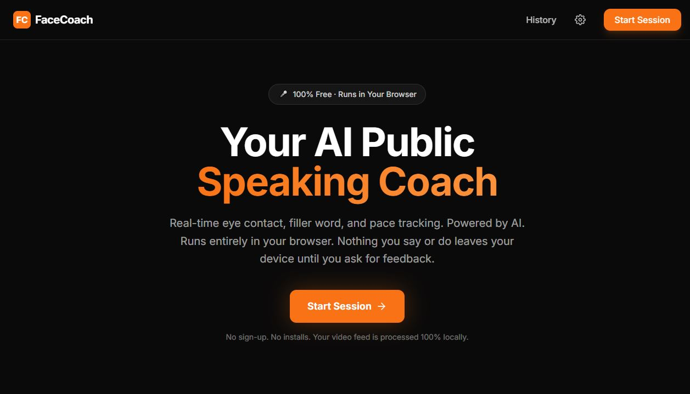
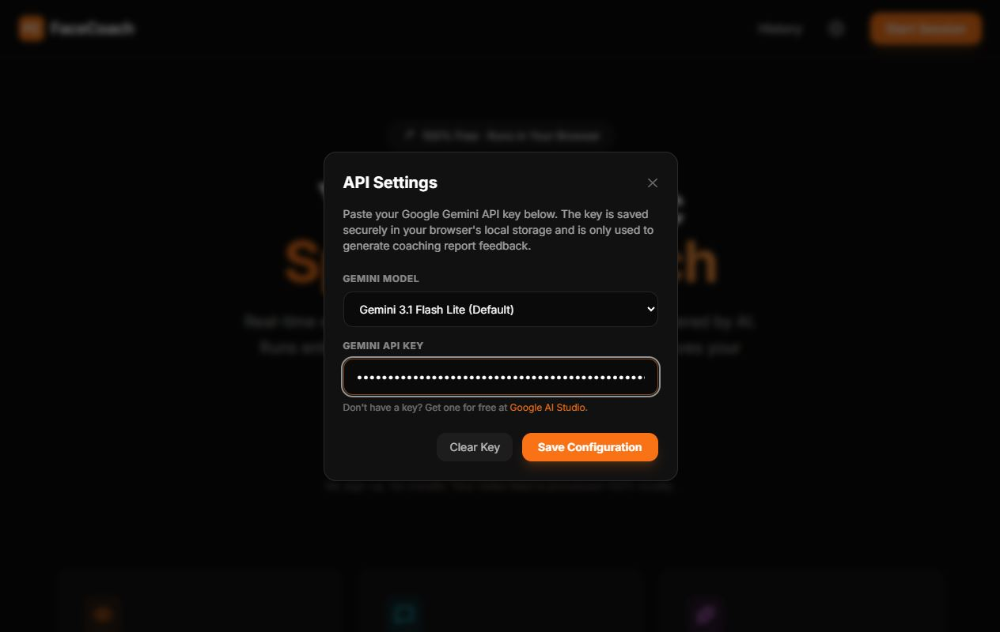
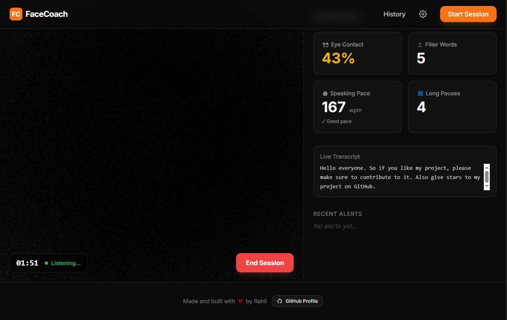
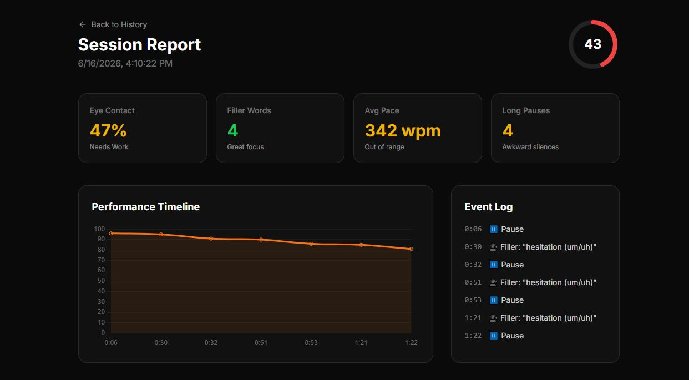
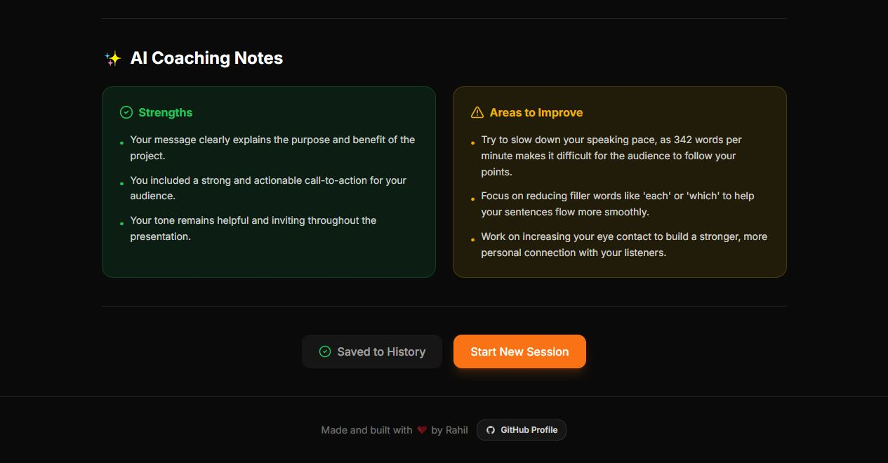
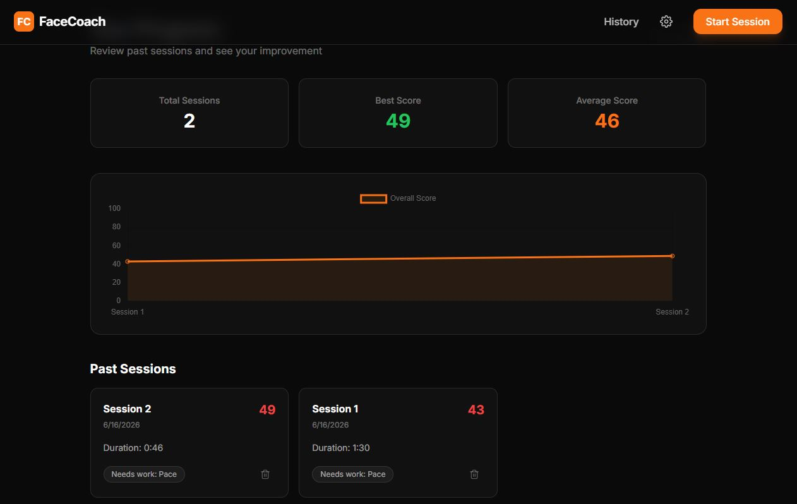

# 🎤 FaceCoach — AI-Powered Public Speaking Coach

<p align="center">
  <strong>Real-time browser-native AI eye contact, pace, and hesitation tracking to build speaking confidence.</strong>
</p>

<p align="center">
  
  
  
  
  
</p>

---

**FaceCoach** is an AI-powered, real-time public speaking coach that runs entirely inside your browser. It helps you prepare for presentations, job interviews, and pitches by privately analyzing your performance. At the end of your session, it uses the **Gemini API** to generate detailed, constructive coaching notes.

## 📸 Screen Gallery

<p align="center">
  <strong>1. Welcome Dashboard</strong><br>
  
</p>

<p align="center">
  <strong>2. Dynamic Gemini API & Model Configurations</strong><br>
  
</p>

<p align="center">
  <strong>3. Live Speech, WPM & Face Tracker</strong><br>
  
</p>

<p align="center">
  <strong>4. Session Report, Timeline Graph & Event Logs</strong><br>
  
</p>

<p align="center">
  <strong>5. AI Strengths & Actionable Improvements</strong><br>
  
</p>

<p align="center">
  <strong>6. History Dashboard</strong><br>
  
</p>

---

## ✨ Features

- **👀 Eye Contact Tracking**: Real-time head pose estimation via MediaPipe FaceLandmarker detects whether you are looking at the camera or looking away.
- **🗣️ Filler Word Detection**: Scans transcript in real time for words like *"like"*, *"basically"*, *"actually"*, *"literally"*, and *"you know"*.
- **🤔 Hesitation (Um/Uh) Proxy**: Micro-pause tracking counts brief silences (1-2s) as hesitation markers (solving the browser-side cloud transcription limitation that strips "um" sounds).
- **⚡ Speaking Pace (WPM)**: Calculates your rolling Words Per Minute (WPM) to check if you are speaking too fast, too slow, or at a perfect pace.
- **⏸️ Long Silence Warnings**: Logs silence events longer than 3 seconds.
- **📈 Detailed Report Charts**: View your score timeline graph, full history, and specific event logs.
- **✨ Gemini AI Feedback**: Generates 3 custom strengths and 3 actionable improvements directly from your transcript and metrics.
- **🔒 Privacy-First Design**: Your camera feed and raw microphone stream **never** leave your device. All calculations run locally on your browser.

---

## 🛠️ Tech Stack

- **Frontend**: React 19 + TypeScript + Vite 8
- **Styling**: Tailwind CSS (custom dark theme, micro-animations, glassmorphism)
- **Computer Vision**: Google MediaPipe Tasks Vision (`@mediapipe/tasks-vision` FaceLandmarker via GPU-accelerated WASM)
- **Speech Engine**: Web Speech API (`webkitSpeechRecognition` with auto-restart pipeline)
- **AI Analysis**: Gemini API (`gemini-3.1-flash-lite`)
- **Charts**: Chart.js + `react-chartjs-2`
- **Data Persistence**: Browser `localStorage` (no database or backend sign-up required)

---

## 🚀 Getting Started

### 1. Clone the Repository
```bash
git clone https://github.com/rahilshahdev/FaceCoach.git
cd FaceCoach
```

### 2. Install Dependencies
```bash
npm install
```

### 3. Get a Free Gemini API Key
Go to [Google AI Studio](https://aistudio.google.com/) and create a free API Key.

### 4. Configure Your API Key (Two Choices)

*   **Option A: Paste in Browser (Easiest)**
    Once you run the app, click the **Settings (Gear Icon)** in the top navigation header and paste your Gemini API Key directly there. It will be stored securely in your browser's `localStorage` and will not touch any files.
*   **Option B: Environment Variable (.env.local)**
    Create a `.env.local` file in the root directory:
    ```bash
    # Windows PowerShell
    copy .env.example .env.local

    # Linux/macOS
    cp .env.example .env.local
    ```
    Open `.env.local` and enter your API key:
    ```env
    GEMINI_API_KEY=your_actual_gemini_api_key_here
    ```

### 5. Run the Local Server
```bash
npm run dev
```
Open **[http://localhost:5173](http://localhost:5173)** in your browser!

---

## 🤖 Changing the Gemini Model

By default, FaceCoach uses the highly efficient `gemini-3.1-flash-lite` model for generating coaching feedback. You can easily change this using **two options**:

*   **Option A: Change via Browser UI (Easiest)**
    Open the app, click the **Settings (Gear Icon)** in the top navigation header, select one of the preset models (Flash Lite, Flash, or Pro) from the dropdown, or choose "Custom Model" and type any Gemini model name. This configures it globally in the app's browser local storage.
*   **Option B: Change via Code**
    1. Open `vite.config.ts` and `api/analyze.ts`.
    2. Replace `gemini-3.1-flash-lite` in the API `fetch` call URLs with your desired model name (e.g., `gemini-3.1-pro`).

---

## 🔒 Security & Privacy

All face landmarking and speech processing run strictly in your browser. No video frames or audio buffers are sent to a cloud server. 

Only the **plain-text transcript** and **final metrics** are securely sent to the Gemini API once at the end of the session to generate your AI Coaching Notes. Your history is saved locally in your browser's `localStorage` and can be cleared at any time.

---

## 📄 License

This project is licensed under the MIT License - see the [LICENSE](LICENSE) file for details.

---

<p align="center">
  Made and built with ❤️ by <a href="https://github.com/rahilshahdev">Rahil</a>
</p>
